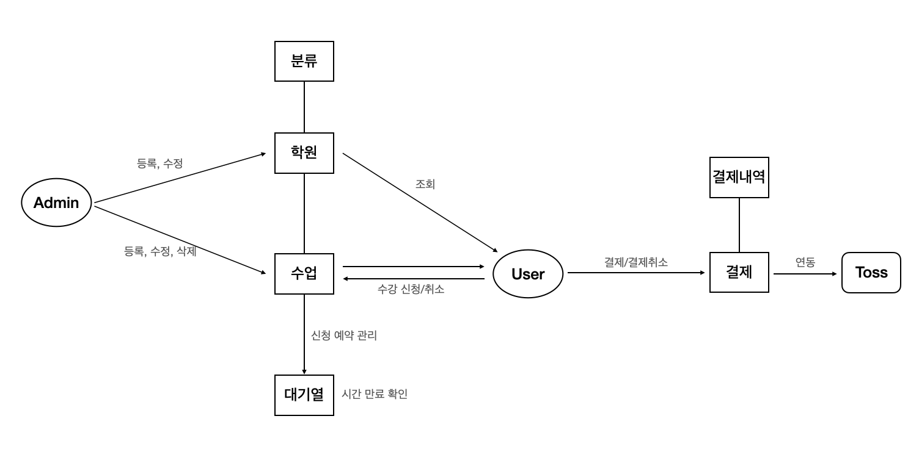

# UseCaseDiagram

### `회원가입`
- Mater (운영진)
  - 학원 사장이 학원정보를 제출한다.
  - 제출이후 학원정보, 학원 사장 계정을 저장한다.
  - SercetKey 발급하여 저장한다.
  - 등록 이후, 학원 운영자에게 Secret 번호를 전달(Secret 번호는 admin 계정을 만들때 필요)
- Admin(학원 관계자)
  - 발급받은 secretkey를 바탕으로 관계자 회원가입 진행
  - 회원가입 진행시 secretKey 중복 확인을 거친다.
- User
  - 회원가입 진행
  

### `학원 등록 과정`
- 마스터(회사 관계자)
   - 학원 정보를 등록/수정/삭제 가능하다.
### `수업 등록 과정`
- 학원 운영진(Admin)
   - 최초 등록한 계정이외 다른 계정을 등록할때는 Secret 번호가 있어야 등록이 가능
   - admin은 수업 정보를 등록/수정 할 수 있다.
   - admin은 수업을 듣는 User들의 신청내역을 볼 수 있다.
### `학원/수업 조회`
- User
   - 분류를 통해 학원/수업 정보를 조회할 수 있다.
   - 학원 정보를 조회할 수 있다.
   - 수업 정보를 조회할 수 있다.
### `수강 신청 및 대기열`
- User 
  - 수업 예약 및 신청(결재)을 할 수 있다.
  - 수업 수강 신청을 하게 되면 해당 대기열 테이블에 저장이 된다.
  - 대기열 테이블에, 수업 수강신청 가능한 인원 만큼 들어 있다면 수강 신청을 할 수 없다.
  - 대기열 테이블에는 20분의 시간이 지나면 자동으로 삭제가 되고, 수업 신청 인원도 삭제가 된 만큼 늘어난다.
### `결재`
- User
  - 결재를 진행하면 결재테이블과 결제내역 테이블에 결제정보가 저장이 된다.
  - 결재는 토스결재와 연동하여 구현