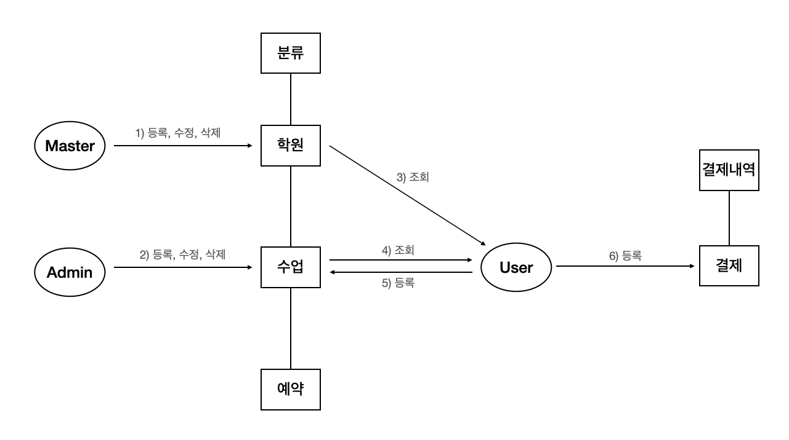

### `학원 등록 과정`
1. 마스터(회사 관계자)
   - 학원 정보를 등록/수정/삭제 가능하다.
   - 등록한 학원의 admin 계정을 등록한다.
   - 등록 이후, 학원 운영자에게 Secret 번호를 전달(Secret 번호는 admin 계정을 만들때 필요)
2. 학원 운영진(Admin)
   - 최초 등록한 계정이외 다른 계정을 등록할때는 Secret 번호가 있어야 등록이 가능
   - admin은 수업 정보를 등록/수정 할 수 있다.
   - admin은 수업을 듣는 User들의 신청내역을 볼 수 있다.
3. User
   - 분류를 통해 학원/수업 정보를 조회할 수 있다.
   - 학원 정보를 조회할 수 있다.
   - 수업 정보를 조회할 수 있다.
   - 수업 예약 및 신청(결재)을 할 수 있다.
     - 예약 테이블은 대기열 테이블이다, 수업 수강 신청을 하게 되면 해당 테이블에 저장이 된다.
     - 대기열 테이블에, 수업 수강신청 가능한 인원 만큼 들어 있다면 수강 신청을 할 수 없다.
     - 대기열 테이블에는 20분의 시간이 지나면 자동으로 삭제가 되고, 수업 신청 인원도 삭제가 된 만큼 늘어난다.
     - 결재를 진행하면 결재테이블과 결제내역 테이블에 결제정보가 저장이 된다.